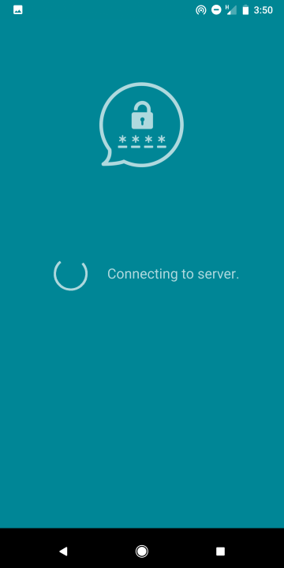
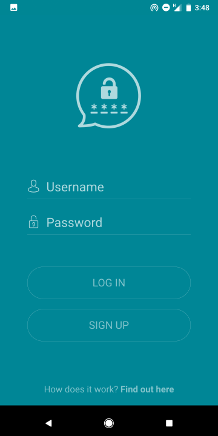
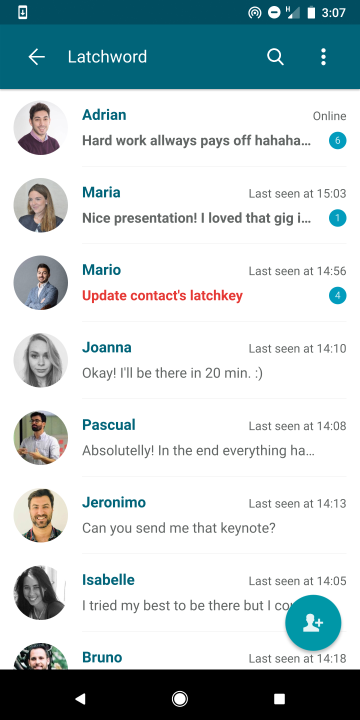
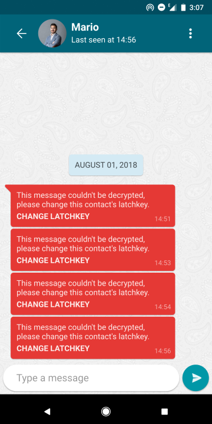
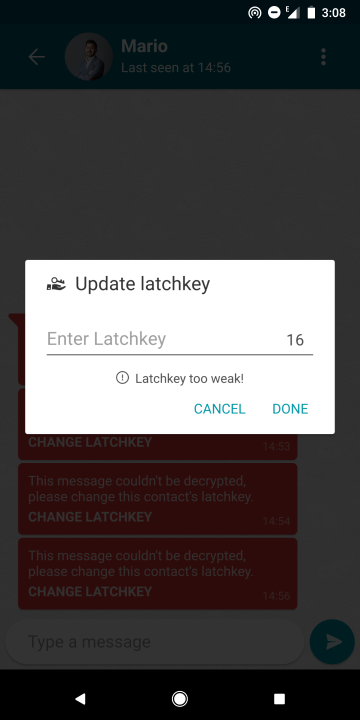
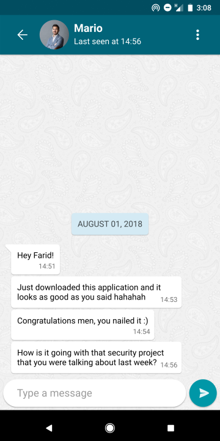
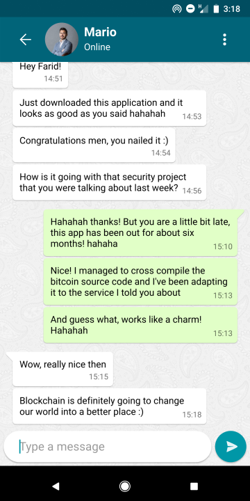
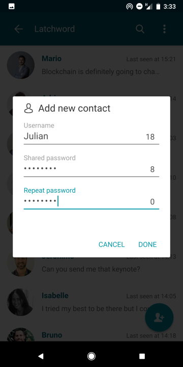
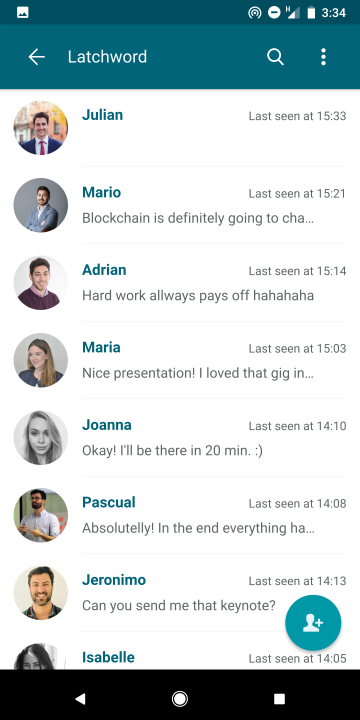
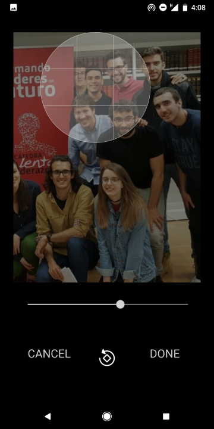

# D-Trust Messaging
The first open source cross-platform messaging app with a decentralized trust mechanism.

**Documentation for this project is being updated since the security mechanism has been changed on 30-Jul**

## Snapshots

### Loading screen while connecting to server

### Logging page

### Contact page

### Wrong latchkey

### Latchkey update

### Latchkey input

### Decrypted conversation

### Fluent conversation upon latchkey update

### Adding a new contact

### New contact added

### New contact profile

### Profile image cropping

### Personal profile

### New contact profile

